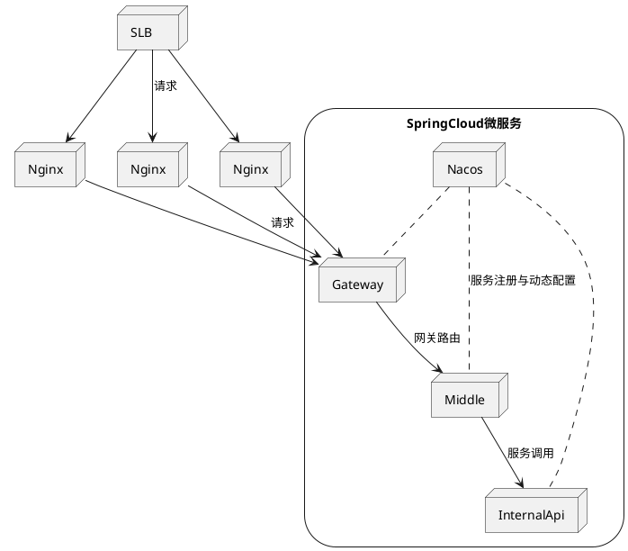

[TOC]

# 微服务架构

Spring Cloud 是微服务系统架构的一站式解决方案，在平时我们构建微服务的过程中需要做如 服务发现注册 、配置中心 、消息总线 、负载均衡 、断路器 、数据监控 等操作，而 Spring Cloud 为我们提供了一套简易的编程模型，使我们能在 Spring Boot 的基础上轻松地实现微服务项目的构建。

Spring Cloud Alibaba 是阿里巴巴在Spring Cloud基础上打造的一套完整微服务架构。提供了一些可以和Spring Cloud项目无缝集成的改进组件，这里主要用到其中的服务注册与配置服务组件Nacos，可替代原本Spring Cloud中的 Eureka + Config + Bus。

本项目以Middle调用InternalApi项目为例，展示Spring Cloud微服务架构。




## 服务注册中心，配置中心和消息总线 - Nacos

微服务架构中一般牵涉到多个服务的管理和调用，所以需要使用服务注册中心来实现服务治理，我们使用Alibaba Nacos 作为服务注册中心，Nacos可以实现服务的发现与注册，监控服务是否正常运行，使服务可以按照服务名称调用，方便进行集群配置，负载均衡等功能的实现。

Alibaba Nacos同时可以作为配置中心使用，取代Spring Cloud 中的Config和Bus模块，实现服用集群配置统一管理和动态刷新。

Nacos在开发过程中可以使用单点模式，配置数据存储在本地嵌入式数据库中，可以在Windows和Linux上非常方便的运行。在实际应用中，可以使用Nacos集群避免单点故障，使用集群时可以使用高可用的mysql服务来确保数据的一致性，详细配置方式可以参考[官方文档](https://nacos.io/zh-cn/docs/cluster-mode-quick-start.html)。

Linux/Unix/Mac(使用ubuntu等系统时请使用bash代替sh)
Stand-alone mode
``` bash
bash startup.sh -m standalone
```

集群模式
使用内置数据源

``` bash
bash startup.sh -p embedded
```
使用外置数据源(mysql)
``` bash
bash startup.sh
```

Nacos默认内存占用较高，可以修改startup.sh中的配置
-Xms: 设定程序启动时占用内存大小
-Xmx: 设定程序运行期间最大可占用的内存大小
-Xmn：新生代大小

## 网关 - Gateway

使用Spring Gateway作为网关服务, Gateway底层使用WebFlux,而webFlux底层使用netty通信(NIO),性能比zuul要好。


## 服务调用 - OpenFeign

使用OpenFeign实现面向接口的服务调用功能，具体见common模块com.onchain.feign package.


## 负载均衡 - Ribbon

默认使用Ribbon做负载均衡，Nacos和OpenFeign均默认集成Ribbon。

IRule接口,Riboon使用该接口,根据特定算法从所有服务中,选择一个服务,

Rule接口有7个实现类,每个实现类代表一个负载均衡算法

## 服务熔断和降级 - Hystrix

Hystrix服务降级

在分布式环境中，不可避免地会有许多服务依赖项中的某些失败。Hystrix是一个库，可通过添加等待时间容限和容错逻辑来帮助您控制这些分布式服务之间的交互。Hystrix通过隔离服务之间的访问点，停止服务之间的级联故障并提供后备选项来实现此目的，所有这些都可以提高系统的整体弹性。

- 服务降级

比如当某个服务繁忙,不能让客户端的请求一直等待,应该立刻返回给客户端一个备选方案

- 服务熔断

当某个服务出现问题,卡死了,不能让用户一直等待,需要关闭所有对此服务的访问

然后调用服务降级

- 服务限流

限流,比如秒杀场景,不能访问用户瞬间都访问服务器,限制一次只可以有多少请求

## 链路监控 - Zipkin (Sleuth)

链路监控使用Spring Cloud Sleuth组件，结合Zipkin jar 可以直观展示调用历史、依赖关系和响应时间等。

如果有需要可以配置HystrixDashboard项目进行实时调用监控。


``` yml

gradle 依赖:

org.springframework.cloud:spring-cloud-starter-zipkin

application.yml 配置

spring:
  zipkin:
    base-url: http://localhost:9411
  sleuth:
    sampler:
      #采样取值介于 0到1之间，1则表示全部收集
      probability: 1

```


