**《DNA2.0 Baas平台系统设计》**

[TOC]

# 1. 总纲

## 1.1. 术语表

| 术语（小写字母开头） | 名称    | 说明 |
| --- | ------- | ---- |
|\<DNA2.0\>  | DNA2.0 联盟链    |    底层联盟区块链的名称  |

## 1.2. 架构设计

### 1.2.1. 架构分析与设计思想

- 系统整体采用Spring Cloud框架构建，使用微服务作为后端系统对接PC端页面，以分布式微服务的架构适应系统的可扩展性和后期性能压力。
- 考虑到区块链系统业务的可视化和监管要求，系统需要区块链浏览器系统对链上数据进行展示。
- 考虑到系统的跨链需求，将采用Poly作为跨链的中继链。
- 考虑到系统对与文件存储方面的需求，将采用PDFS去中心化分布式文件存储系统。

### 1.2.2. 系统架构图

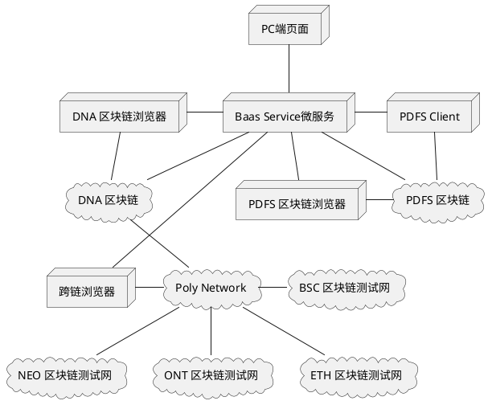

## 1.3. 功能清单

功能清单参考产品设计文档： https://git.ont.io/EGS/SCF-Product

# 2. 后端设计

## 2.1. 后端技术选型

### 2.1.1. 后端技术框架

Spring Cloud 是微服务系统架构的一站式解决方案，在平时我们构建微服务的过程中需要做如 服务发现注册、配置中心、消息总线、负载均衡、断路器、数据监控 等操作，而 Spring Cloud 为我们提供了一套简易的编程模型，使我们能在 Spring Boot 的基础上轻松地实现微服务项目的构建。

Spring Cloud Alibaba 是阿里巴巴在Spring Cloud基础上打造的一套完整微服务架构。提供了一些可以和Spring Cloud项目无缝集成的改进组件，这里主要用到其中的服务注册与配置服务组件Nacos，可替代原本Spring Cloud中的 Eureka + Config + Bus。

选择框架版本信息：
Spring Cloud Hoxton.SR1
Spring Boot 2.2.2.RELEASE
Spring Cloud Alibaba 2.1.0.RELEASE

选择组件
网关：Spring Cloud Gateway
服务注册与发现：Spring Cloud Alibaba Nacos
服务间调用：Spring Cloud OpenFeign
服务熔断和降级：Hystrix
链路监控：Spring Cloud Sleuth（Zipkin）

### 2.1.2. 项目构建工具

相比于Maven，Gradle抛弃了Maven的基于XML的繁琐配置，使用Groovy语言，大大简化构建代码行数，并且对于依赖冲突解决，项目构建速度和灵活性存在优势。
综合考虑选择Gradle 6.1.1版本。

### 2.1.3. 服务器运行平台

Ubuntu 18.04 LTS

### 2.1.4. JDK

JDK8.x的Lamda Expression + stream可以使代码更简洁，性能更优，因此选择JDK 1.8.0_241版本。

### 2.1.5. 关系型数据库

MySql:5.6 版本之前对json支持较差，5.7之后对json格式存储和搜素有显著提升。与其他的大型数据库
例如 Oracle、DB2、SQL Server等相比，MySQL自有它的不足之处，但是对于本项目来说，MySQL提供的功能已经绰绰有余。而且MySQL是开源软件，可以大大降低软件成本，因此选择稳定的5.7.29版本。

#### 2.1.6. 缓存数据库

Redis 4.0.11 支持多种数据类型存储；支持持久化；支持主从备份，可以搭建分片集群；支持NAT和Docker。

#### 2.1.7. 链路监控

Zipkin是目前应用广泛的分布式跟踪系统。它有助于收集解决微服务架构中的延迟问题所需的时序数据，管理这些数据的收集和查找。

Zipkin提供了一个依赖关系图，显示了每个应用程序通过的跟踪请求数。如果要解决延迟问题或错误，可以根据应用程序，跟踪长度，注释或时间戳对所有跟踪进行筛选或排序。选择跟踪后，可以看到每个跨度所需的总跟踪时间百分比，从而可以识别问题应用程序。 Zipkin基本可以支持所有的应用、所有的语言，并接提供了各种客户端，在Spring Cloud体系中与Slueth配合集成为配置、部署便捷的应用。

目前数字资产团队也在使用Zipkin，综合目前项目性能需求和生产环境技术框架统一性需求使用Zipkin_2.11.6作为链路追踪监控工具。

#### 2.1.8. 腾讯云对象存储

对象存储（Cloud Object Storage，COS）是腾讯云提供的一种存储海量文件的分布式存储服务，用户可通过网络随时存储和查看数据。腾讯云 COS 使所有用户都能使用具备高扩展性、低成本、可靠和安全的数据存储服务。

COS 通过控制台、API、SDK 和工具等多样化方式简单、快速地接入，实现了海量数据存储和管理。通过 COS 可以进行任意格式文件的上传、下载和管理。腾讯云提供了直观的 Web 管理界面，同时遍布全国范围的 CDN 节点可以对文件下载进行加速。

## 2.2.1. 模块划分结果

- 考虑到本平台会有2个类型的用户入口，使用1个统一的gateway网关服务进行验证，根据用户角色不同对不同url有不同访问权限。

- 考虑到本平台用户管理的统一性，使用Baas-Service模块统一管理用户（客户）注册登录和权限等账户信息。 

- 考虑到系统涉及大量的用户证件类、协议类文件的保存，我们将引入腾讯云对象存储服务，以便对文件进行安全可靠的管理和保存。

### 2.2.2. 后端架构图

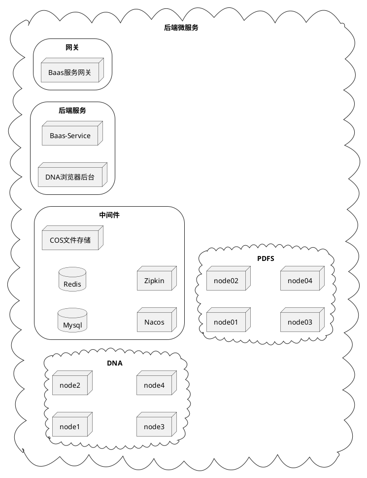

### 2.2.3. 中间件部署

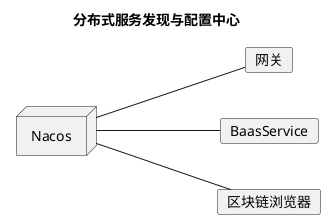

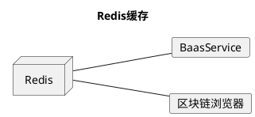

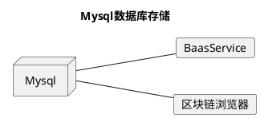

## 2.2. 后端接口功能设计

后端交互接口参考[《InterfaceDesign》](./InterfaceDesign.md)。

# 3. 前端设计

## 3.1. 前端设计思想

本项目的前端页面将以Vue.js组件化的形式设计。

## 3.2. 前端技术选型

### 3.2.1. 开发框架

Vue.js是一套构建用户界面的渐进式框架。与其他重量级框架不同的是，Vue 采用自底向上增量开发的设计。Vue 的核心库只关注视图层，并且非常容易学习，非常容易与其它库或已有项目整合。另一方面，Vue 完全有能力驱动采用单文件组件和Vue生态系统支持的库开发的复杂单页应用。目前使用版本2.5.2。

### 3.2.2. 前端模块打包工具

webpack是一个现代javascript应用程序的静态模块打包器。前端的编译、打包和发布离不开webpack的输出。目前使用版本3.6.0。

### 3.2.3. 前端架构图

# 4. 区块链智能合约设计

## 4.1. 区块链技术选型

区块链作为一种整体技术解决方案，融合吸收了分布式架构、分布式存储、点对点网络协议、加密算法、共识算法、智能合约等多类技术。
\<DNA\>区块链平台是基于现有的Ontology开源项目进行开发，聚焦于联盟链分布式商业需求，从业务适当性、高性能、技术可行性、成本等多个维度进行综合考虑，打造联盟链版本的区块链解决方案。

## 4.2. 智能合约设计（待修改）

### 4.2.1. 智能合约设计思路

- 考虑到随业务发展可能会出现智能合约升级，将业务相关智能合约划分为两层：数据层和逻辑层。数据层用于保存业务数据，业务的逻辑处理由逻辑层执行。如果出现业务逻辑变更，只更新逻辑层合约即可，数据层合约保持不变。
- 考虑到随业务扩张可能会增加更多业务智能合约， 增设介面合约用于各类业务合约的路由分发，在介面合约中通过传入业务合约名参数即可调用到指定业务合约，使合约调用更加简便。

### 4.2.2. 智能合约架构图

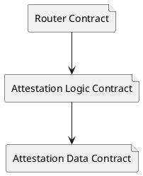

# 5. 数据库表设计

详细数据库表设计见[《SQL初始化脚本》](./sql/dna2_baas_ddl.sql)

# 6. 关键数据流

## 6.1 BaasService

### 6.1.1. 用户注册

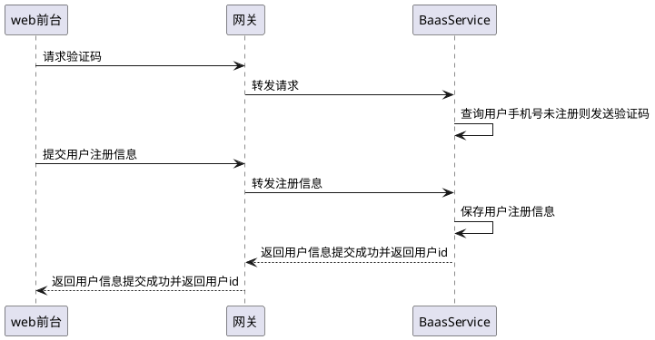

### 6.1.2. 用户登录

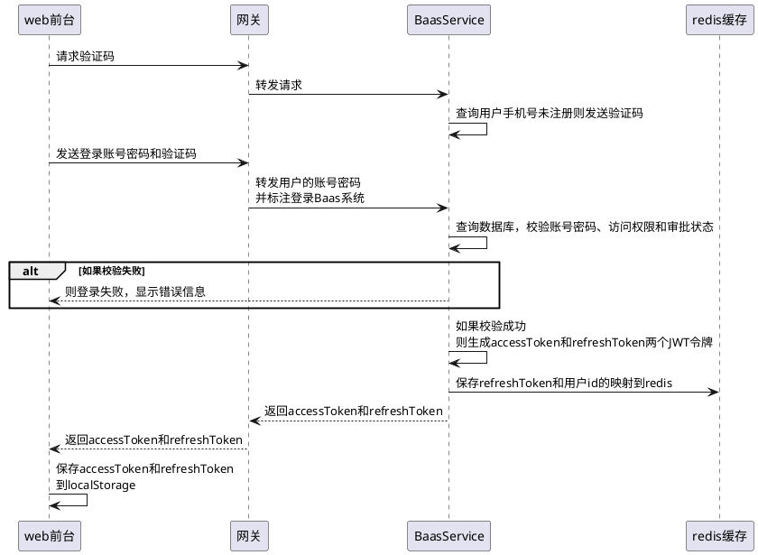

### 6.1.3. 登出（其他角色登出类似）

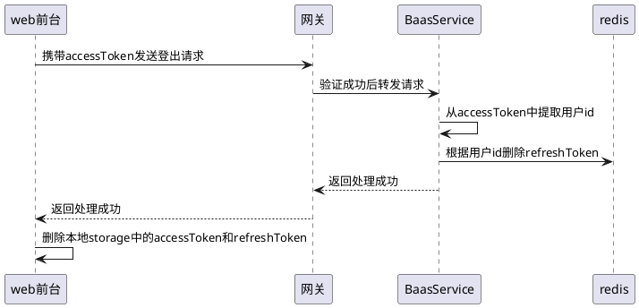
### 6.1.4. 登录后accessToken校验（适用于所有需要登录的操作，后续流程省略网关验证）

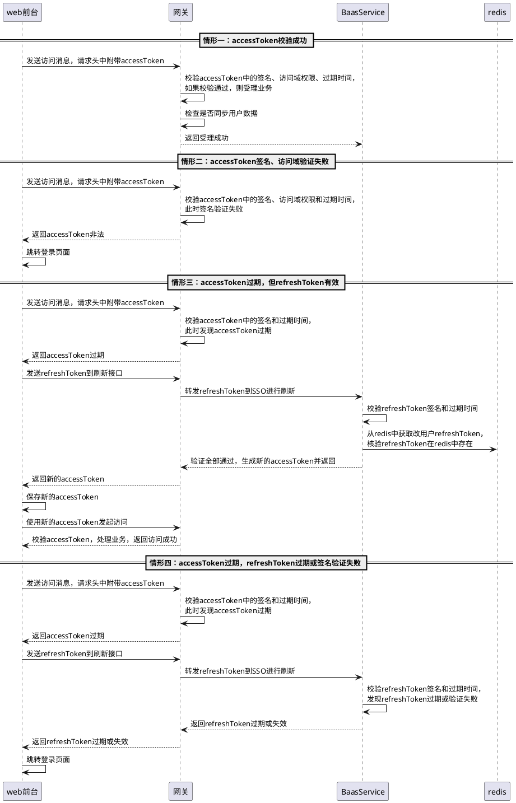

### 6.1.5. 文件上传（登录后，省略网关验证步骤）

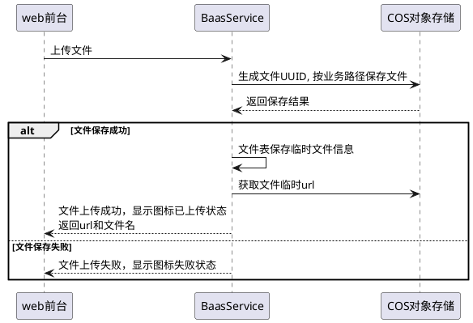

